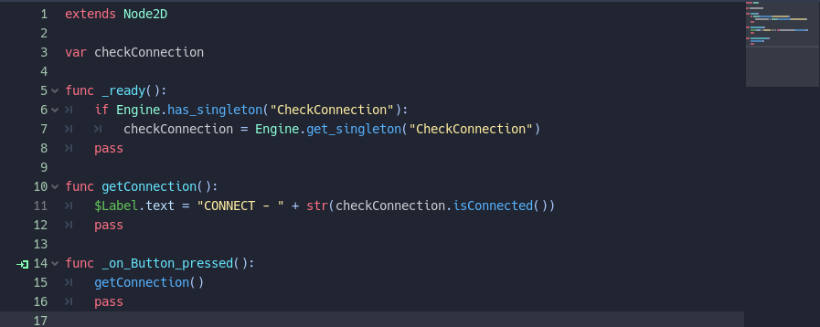
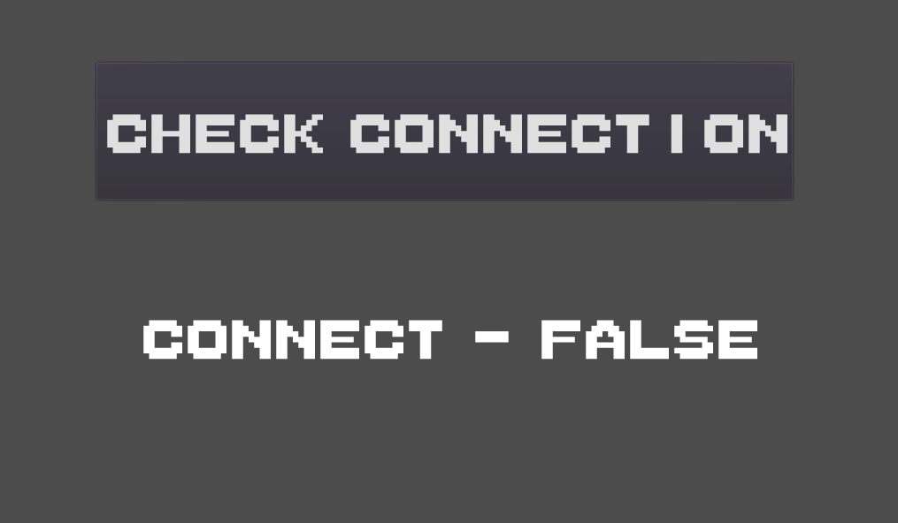
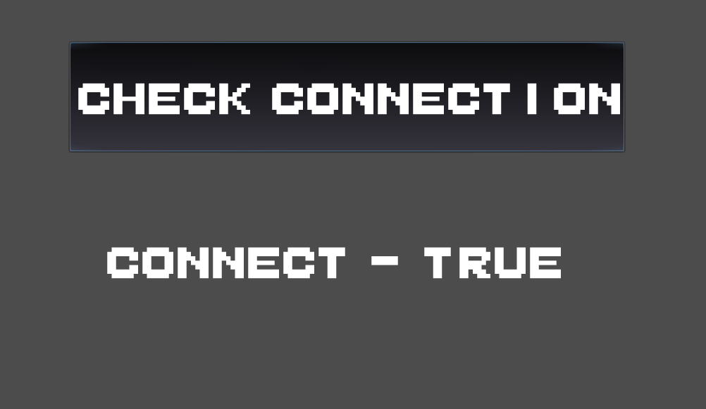

Check Connection with Internet Godot
===
- This is a plugin for godot 3.2 that checks the status of the internet.
- It is very useful since you need to check the status of the internet.
- In the midst of my need I decided to create it.
- It's simple, easy and practical.


How to use
----------
- Configure, install  and enable the "Android Custom Template" for your project, just follow the [official documentation](https://docs.godotengine.org/en/latest/getting_started/workflow/export/android_custom_build.html);
- go to the [release tab](https://github.com/alissonrichardy/check-connection-godot), choose a version and download the respective zip package;
- drop the ```check-connection``` directory (from the zip package) inside the ```res://android/``` directory on your Godot project.
- on the Project Settings -> Android -> Modules, add the string:

```
org/godotengine/godot/checkConnection
```

Sample usage code



Sample screen one



Sample screen two




### Methods
```python
# @return bool true if have connection
isConnected()

```

### How to use

```python
extends Node2D

var checkConnection

func _ready():
	if Engine.has_singleton("CheckConnection"):
		checkConnection = Engine.get_singleton("CheckConnection")
	pass

func getConnection():
	$Label.text = "CONNECT - " + str(checkConnection.isConnected())
	pass

func _on_Button_pressed():
	getConnection()
	pass
```